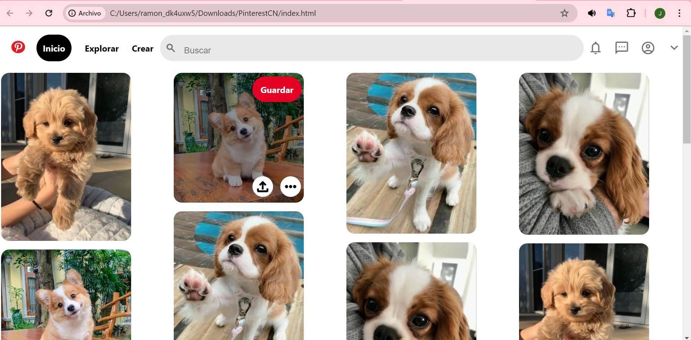

# Clon de Pinterest con HTML y CSS
Este proyecto es un clon de la interfaz de usuario de pinterest, creado puramente con HTML5 y CSS3.

Se enfoca en replicar la apariencia visual de Pinterest, ofreciendo una experiencia de navegación similar con un diseño responsive y funcionalidades básicas.

### Características

* **Diseño responsive:** adaptable a diferentes tamaño de pantalla para una experiencia de usuario óptima en dispositivos móviles y de escritorio.

* **Interfaz de usuario intuitiva:** inspirada en pinterest con una navegación fácil y accesible.
* **Interacciones dinámicas:** efectos visuales para elementos interactivos como botones y enlaces.
* **Iconografía y estilos modernos:** uso de la biblioteca e iconos de Material Design y estilos CSS para una mejor apariencia.

### Tecnologías utilizadas

+ **HTML5:** para la estructura básica del sitio.
+ **CSS3:** para el diseño y el estilo, incluyengo _flexbox_ para un diseño responsivo y efectos de _hover_.

### Vista del previa proyecto 

### Contacto 
Si te gustaría invitarme a colaborar en un proyecto, [contactame](https://htmlcolorcodes.com/es/)
